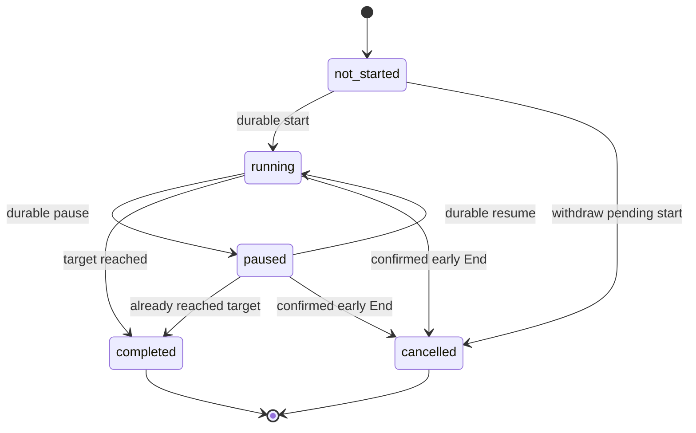

# Session reliability: reviewed design

Prepared 9 October 2026 against `main` at `22dc846a981953ca8e3c227ef50a8aa7ba7b0f00`.

**Review amended 10 October 2026.** The relayed review approves the design with the changes below and requests Package 1's pure journal logic and tests first. Packages 1 and 2 form one release. Slice A has no backend changes; Slice B's SQL remains a future reviewed proposal. Native-module design approval is recorded, but there is no authorization to apply a live migration, build, commit or deploy. Package 0 itself executed no unit, SQL or device tests. Repository snapshots are not a fresh inspection of the live backend. Package 1's actual results and remaining integration work are recorded separately in `session-reliability-package1.md`.

The accepted amendments are: storage interface with AsyncStorage first and native authority second; shared JSON vectors and future JVM tests; a visible local-only offline state; smaller server-started-session Slice A; differential accounting tests before the Slice B kernel refactor; rate-limit table deferred; imports never update legacy streak metadata or recurring quests; 15-second clock-warning threshold; separate staging Supabase project and backup before any production application.

## 1. Recommendation and scope

Keep the agreed product promise: choose something that matters, protect time for it, and see your effort grow. This package designs reliable sessions for existing signed-in users. It does not implement routines, widgets, protection, guest access, partial credit, monetisation or iOS Live Activities.

Use one durable session identity, persist commands before sending them, reconcile uncertain replies before retrying, and show rewards only after an authoritative saved receipt. Keep online timing authoritative. A separate, bounded import path accepts completed offline records.

For the full Android requirement, the review approves a small local Expo module in Kotlin. It will own the durable Android journal, native notification actions and alarm scheduling through one command handler. First implement a storage interface, pure logic and an AsyncStorage adapter; then the native adapter. Packages 1 and 2 ship together, so the development AsyncStorage adapter is not released as a competing Android authority and no production-store migration is required. The fallback's actions must open the app and use its JavaScript writer.

Three corrections matter before implementation:

1. A journal inside `TimerContext` alone cannot restore an offline cold start. The current authentication and profile gates prevent that provider from mounting without successful network verification. A separate, limited local recovery admission is needed.
2. A lost reply is not proof that a transition failed. The server may already have saved it. Identity and operation receipts must resolve this before importing or retrying.
3. Android Force Stop is different from ordinary process death. Recovery after reopening is a valid requirement; delivery of alarms while the package remains force-stopped cannot be promised.

The reviewed decisions and current work boundary are recorded in sections 11 and 12. Review approval does not apply a database contract or establish device behavior.

## 2. Facts verified against the repository

| Brief claim | Finding and evidence |
| --- | --- |
| Starting needs the server and returns a server-generated ID. | Confirmed. `src/services/sessionService.ts:84` invokes the existing five-argument RPC. `docs/progression-live-contract.sql:431` defines it; the insert relies on the existing UUID default. There is no client identity parameter. |
| One unfinished session and a 1-second to 8-hour target. | Confirmed in the saved start function. It locks the profile, checks active/paused sessions, and validates `1..28800` seconds. This is an RPC invariant, not evidence of a unique open-session index in today's live database. |
| Pause, resume, cancel and complete are server calls. | Confirmed in `sessionService.ts`. The saved pause/resume/cancel functions use status-conditioned updates. They are not receipt-idempotent: a repeat after a lost successful reply can raise a state error. Cancellation exists and awards nothing. |
| Completion rejects early claims, caps credit and replays results. | Confirmed in `docs/goal-completion-base.sql:58`. It locks the owned session before the profile, calculates elapsed time from server fields, rejects below target, caps at target, and replays `credit_result` for completed sessions. Legacy completed rows return their stored historical awards. |
| Restore depends on Supabase; no local running record. | Confirmed. `TimerContext.tsx:385` calls `getOpenActivitySession()`. That read selects active/paused rows only, so it cannot distinguish a successful completion with a lost reply from a missing session. No durable running journal or pending completion queue exists. |
| The visible timer needs a deadline rather than an interval. | The code already uses `endTimeRef` and `Date.now()` (`TimerContext.tsx:153`, `303`). Intervals refresh the display. The missing piece is durable storage and authoritative timing snapshots. Start and resume currently establish the local deadline after the RPC reply; pause calculates remaining time after its reply, introducing network-delay drift. |
| Retry UI exists. | Confirmed: `retryRestore`, `retryAction`, `retryCompletion` and the completion-save message are already present. This work must retain them and improve uncertain-outcome reconciliation. |
| Notification is static, without native countdown/progress/actions. | Confirmed in `sessionNotificationService.ts:58`. It posts a sticky static ongoing notification and a time-interval completion alert. No notification categories or native countdown/progress builder are used by the application. |
| Installed Android uses a preview APK profile. | Confirmed in `eas.json` and `docs/installed-android-testing.md`. Native changes require a fresh installed build. Expo Go is not a test of a new local native module. No build was run. |

Additional evidence affecting the design:

- `AuthContext.tsx:42` verifies a restored session using `auth.getUser`; `src/app/_layout.tsx:282` blocks on verification error. `UserContext.tsx:83` then loads the profile from the server. A persisted token alone must not become a verified online identity.
- Existing accounting is exact seconds with independent character/area remainder banks, one XP per 60 seconds, existing level curves and **zero new Gold**. `goal-completion-base.sql` is the relevant later completion snapshot. The older completion in `progression-live-contract.sql` awards Gold and must not be copied into the new design. `docs/progression-foundation.md` records the approved accounting activation on 4 October; it was not rechecked live here.
- Current completion attribution is the profile's local date **when the server handles completion**, including delayed recovery. D5's actual end-day attribution is a proposed change for imports, not “same as today”.
- The displayed Focus streak derives from qualifying completed-session dates. The backend `streak_count` retains its separate daily-goal meaning. Do not conflate these.
- The goal-edit/scheduling proposal described in `docs/mobile-polish.md` is separately unapplied. It must not be assumed present or bundled into this milestone.
- `app.json` already declares `SCHEDULE_EXACT_ALARM` and `POST_NOTIFICATIONS`. Its `allowSchedulesExactAlarm` plugin option is not an accepted property in the installed plugin's typed configuration; the explicit manifest permission is the relevant existing declaration. No permission was added or removed.
- Installed `expo-notifications` is 57.0.17, matching the manifest's `~57.0.17` range. Native-source findings below refer to that installed version. Recheck the resolved package before implementation/build review.
- Existing session tests mock native/network behavior. Minimising and reopening the same provider is not proof of process-death recovery.

The repository's required [Expo SDK 57 documentation](https://docs.expo.dev/versions/v57.0.0/) was read. Supabase and PostgreSQL guidance was used for the proposal, with no Supabase account or database access.

## 3. State machine and durable record

### 3.1 Separate activity, acknowledgement and saving

Use the five activity states requested in the brief. Backend `active` maps to local `running`.

This graph describes local intent. A completion can be locally finished while its reward remains pending. Terminal records are immutable; reconciliation attaches a receipt or conflict outcome instead of rewriting a completed record into a second session.

Keep separate fields for:

| Axis | Meaning |
| --- | --- |
| Activity | `not_started`, `running`, `paused`, `completed`, `cancelled`. |
| Command acknowledgement | Prepared, awaiting reply, outcome unknown, acknowledged, or rejected. Includes a persistent operation ID and expected server revision. |
| Timing provenance | Provisional server timing, unverified local timing, or final `server_timed` / `client_reported` classification from the server. |
| Saving | Pending, retry scheduled, waiting for authentication, synced, or explicitly not accepted. |
| Presentation | Countdown, paused, completed on this phone, waiting to sync, or confirmed saved. Never use a failed network call as a failed-focus label. |

There is one locally running/paused session at a time. Finished records can wait in a queue while another non-overlapping session runs, once the import capability has been confirmed. An unresolved legacy start must be reconciled before another online start.

### 3.2 Proposed journal envelope

Store a versioned envelope per backend/account namespace, containing one active record, pending terminal records and retained receipts. The envelope includes `schemaVersion`, `ownerId`, backend namespace, account generation, and monotonically increasing local revision.

Each record contains:

- Immutable `clientSessionId`; nullable `serverSessionId`; creation identity and source.
- Activity state; target seconds; task, focus-area, activity type and notes snapshots. Names are display snapshots, not ownership proof.
- Ordered active segments, accumulated active milliseconds and paused remaining milliseconds.
- Persisted wall-clock deadline `endsAt`; wall and monotonic clock anchors plus boot identity where the approved native adapter supplies them.
- Intended completion time, observation time and alert delivery time as separate values. Opening the app tomorrow must not silently change yesterday's offline end time.
- Last acknowledged server state, server time, elapsed time, target, revision and saved receipt.
- Ordered commands with operation UUID, sequence, expected revision, original immutable payload, acknowledgement state and result.
- Provisional verification, clock warnings, device time zone and the last verified profile time-zone snapshot.
- Sync status, bounded retry count/backoff deadline and a structured explanation code. Keep auth credentials out of this record.

Use milliseconds for local arithmetic and convert validated active duration to integer seconds once. Full completion credits the target, not repeated rounded segments or a delayed alarm's delivery time.

### 3.3 Write and side-effect ordering

Every transition follows this order:

1. Validate account generation, current state and expected revision.
2. Persist the command and resulting local record atomically through the sole owner.
3. Update the visible state and reconcile the native notification/alarm from the saved revision.
4. Send the server request if permitted; store its authoritative reply as another atomic revision.

If step 2 fails, do not send an RPC or claim the transition succeeded. Keep the last confirmed state and offer a calm storage retry. If a reply arrives but saving it fails, retain the already-persisted intent and reconcile that operation on restart. Do not assume an unrecorded reply means the server rolled back.

An OS alarm is an observer, not a reward authority. Its receiver verifies the identity and revision, marks an expired running record finished once, and posts the alert. A stale alarm after pause, resume or cancel is ignored. JavaScript expiry and the receiver call the same command handler, so they cannot create two terminal entries.

Recovery loads the journal before displaying a countdown, derives elapsed time, resolves already-expired deadlines once, repairs notification scheduling, and then reconciles with the server. The interval is only a display refresh.

Corrupt or unknown-version envelopes are preserved in quarantine before resetting anything. If quarantine storage fails, retain the original bytes and offer recovery instead of overwriting them. The journal is a recovery queue and recent receipt cache; accepted history and completion idempotency remain server-owned. Keep up to the latest 20 safely settled records. An explicit `compact` action removes older eligible records and all their commands in one revision. Command-appending transitions perform the same pruning automatically, with additional oldest-first pruning if the 100-record, 1,000-command or 512KiB bound needs space. A 30-day age floor is deliberately omitted: it would still stop someone who finishes 101 sessions in a month.

Only synced terminal records, or terminal rejected records explicitly acknowledged through `dismiss`, are eligible. Running, paused, pending, waiting-auth, prepared, unknown and rejected-undismissed work stays. Dismissal changes acknowledgement metadata only and cannot award rewards, cancel a server session or hide unresolved work. A retained receipt stays immutable; deleting an eligible record deletes its complete local receipt/command group together. If protected work alone fills a bound, refuse the new operation without changing persisted bytes and offer recovery of that work. The UI must not reset or spin indefinitely on that failure. Clearing app data or uninstalling can erase local-only work; this is not durable cloud storage.

## 4. Store and offline admission

### 4.1 D2: approved adapter sequence

AsyncStorage is already available and supports a serialized JavaScript writer. However, a read/modify/write sequence is not a transaction or compare-and-swap across independent JavaScript runtimes or native receivers. Two writers can overwrite each other's session state. Its [documented storage limits](https://react-native-async-storage.github.io/async-storage/docs/limits/) also argue for bounded envelopes.

| Option | What it supports | Consequence |
| --- | --- | --- |
| AsyncStorage adapter first | Pure logic can be tested in Node and the foreground adapter used in Expo Go. Actions open the app. | Development/fallback adapter only; no immediate native controls with JS absent. |
| Kotlin adapter second, approved | App commands, notification receivers and alarms use one durable repository even without a React runtime. | Packages 1 and 2 release together; a fresh installed build and JVM/device tests are required. Never enable both authorities for the same scope. |

For B, use an app-private, credential-protected AtomicFile snapshot per owner, a shared command repository and mutex, expected revisions and operation deduplication. Receivers stay in the default app process. AtomicFile protects replacement but does **not** provide locking by itself; the repository must serialize every read/modify/write. Do not let JS write a parallel AsyncStorage copy. See [Android AtomicFile](https://developer.android.com/reference/android/util/AtomicFile).

The native journal has no Supabase credentials and does not perform reward RPCs. JavaScript reads the same store and owns authenticated reconciliation when available. An Expo Go fallback can exercise pure logic and foreground recovery through A, but must be clearly labeled as a different capability, not validation of B. iOS/web can keep existing behavior; Android-specific reliability is the present scope.

### 4.2 Limited local recovery admission

The review approves a separate local-only mode for an account previously verified online on this installation. Store its owner marker and minimal profile/onboarding snapshot only after successful verification. Match the locally persisted credential owner's ID, journal owner and account generation. Check recovery-link guards before opening Home or the timer.

This approved mode must show a visible offline/local-only state. It may restore local timers and, after the offline contract is enabled, start/save local sessions using cached setup. It must not fabricate `verifiedUser`, allow account edits, or send server writes in local-only mode. Network reads/writes resume only after fresh same-owner verification succeeds. A stored [Supabase session](https://supabase.com/docs/reference/javascript/auth-getsession) is not equivalent to a verified [getUser response](https://supabase.com/docs/reference/javascript/auth-getuser).

Explicit sign-out, missing credentials, malformed ownership, known invalid credentials or account mismatch closes local admission and cancels that owner's notifications. A temporary verification/refresh network failure preserves the record. Expired credentials require reauthentication before upload, but should not erase an established owner's local work. Existing password-recovery routes and tests retain priority. An installation that has never verified an account cannot first-use the app offline.

Do not equate a null `getSession()` result with deleted credentials: the installed auth client can return null with an expired-token refresh error while retaining its stored credentials for a retryable network failure. Resolve the matching persisted owner through a reviewed auth-storage adapter before/independent of refresh, without logging tokens or granting online identity. Distinguish missing storage, explicit sign-out and known invalid-auth outcomes from temporary refresh failure. This is necessary for an offline restart after token expiry.

Pending work remains tied to its original owner across sign-out. If the UI eventually allows sign-out with pending work, explain that it remains on this phone and can sync when that account returns. Never submit it as the next account. Current active-session sign-out restrictions stay unless separately changed.

The immutable queue owner is separate from the current admission generation. Persist the active owner/generation through the native journal authority and revoke it on sign-out/account switch before a stale receiver can mutate state. Old action tokens and in-flight UI replies become invalid. When the original owner verifies again, rebind eligible pending records to the new admission epoch for reconciliation; their original IDs/payloads remain unchanged. A new login generation must not strand that owner's older queue.

## 5. Transition contract and mixed cases

### 5.1 Per-transition behavior

| Transition | Persist locally first | Connected behavior | Offline behavior after capability approval |
| --- | --- | --- | --- |
| Start | UUID, target/setup, start intent and operation ID. | Identity-aware start returns server ID, timing snapshot and revision. Derive the deadline from that snapshot, accounting for request timing instead of starting a fresh target after the reply. | Create one local running record and deadline with no RPC. Mark local provenance. |
| Pause | Close active segment; remaining time; pause command. | New receipt-aware transition returns authoritative paused elapsed time. Pending intent is distinct from acknowledgement. | Pause immediately through the journal owner; cancel alarm; retain the local segment and pending command. |
| Resume | New segment; new deadline; resume command. | Server snapshot sets the authoritative remaining time/deadline. | Resume locally from saved remaining time; reschedule alarm. |
| Target reached | Immutable finished record with intended end time; one completion command. | Use the unchanged server-elapsed completion gate via the receipt-aware wrapper. No early credit. | Keep full-target completion locally pending; show “Saved on this phone. It will sync when you're online.” |
| Early End | Confirmed cancellation intent; close segment; cancel command. | Cancel once; no XP and no quest completion. | Retain cancellation and clear alarm/ongoing notification. If a same-identity server start may exist, reconcile/cancel only that owned identity later. |
| Retry/reconcile | Attempt/deadline and receipt intent, not another session. | Read all-state identity/operation result before retrying unknown outcomes; replay the same operation ID. | Preserve the record and backoff state. No guessed rewards. |

Before the new backend capability exists, Package 1 persists intents and the last confirmed online state but does not enable new offline starts or optimistic offline pause/resume. Known server sessions can continue their last confirmed countdown offline and queue ordinary completion attempts. Ambiguous legacy starts cannot safely be matched by title/time alone.

Package 1 also supplies a conservative, unwired legacy recovery helper. After fresh same-owner/backend verification, an unknown start may be adopted only from a complete authoritative read containing exactly one open session with matching target and setup identity, and a start within the documented 15-second window. It produces an acknowledgement for the original operation/client identity, never another start or reward. No match, ambiguity, stale admission, mismatched setup/owner or a timing discrepancy leaves the unknown intent intact. This match is not a server operation receipt and does not prove the original request created the row. The current `getOpenActivitySession` uses a one-row limit, so it cannot establish that uniqueness; a complete read and provider integration still need separate implementation and tests.

An identity-aware request that loses its reply never falls back to a new UUID. It stays a pending start under the same identity. Reconciliation determines whether it was created. If a user continues that same record locally before the outcome is known, any unverified timing is resolved through the mixed-session path; it is not a second start. An unsent start withdrawn locally stays cancelled; an in-flight start needs a cancellation tombstone to prevent late delivery from resurrecting it.

Once a running session has accepted unverified local timing, its journal remains the timing authority through reconnect until terminal same-row import. Do not replay its historical offline pauses/resumes as present-time server transitions or replace its countdown with the stale server remaining time. Read remote revisions/terminal outcomes for conflict detection; local transition intents are superseded by the final immutable segment record, rather than independently replayed. Further controls remain local and client-reported even while connectivity returns.

### 5.2 Classification and user outcome

| Case | Classification and reconciliation | User sees |
| --- | --- | --- |
| Started online; network lost; no local timing changes | Remains eligible for `server_timed`. Server fields can calculate elapsed time; reconnect completes the same ID. | Correct saved countdown; then waiting to sync if completion cannot be confirmed. |
| Pause/resume reply lost but server applied it | First replay/read the operation receipt. If every timing change is proven server-applied, retain `server_timed`. Unknown acknowledgement alone is not evidence of client timing. | Checking the saved state, then the resolved timer. |
| Online session paused or resumed locally without server timing | `client_reported` once local timing affects the result. Finalize the **same** owned server row after revision checks; do not cancel it and import a new one. | Local paused/running state and waiting to sync. |
| Offline start, pause, resume and full finish | `client_reported`; validate ordered segments and bounds, insert once by client ID. | Immediate local timer and saved-on-phone completion; rewards after sync. |
| App process killed, reopened offline | Restore via local admission and journal, not a cloud read. Derive the deadline; classify from actual timing provenance, not process death. | Timer or completed-on-phone state without an account-loading wall. |
| Reboot while running | Rebuild scheduling after boot/unlock; monotonic anchor resets, wall deadline provides fallback. Flag suspicious clock history. Reboot alone does not change server timing. | Restored timer or a single missed-completion indication. |
| Another device already completed the same server row | Existing saved receipt wins. No import or second reward, even if this phone's provisional record differs. | Already saved; refresh confirmed progress without replaying reward animation. |
| Another device cancelled or changed the same row | Revision conflict; preserve the local record for explanation. Do not overwrite newer remote state. A proven remote completion is treated as above. | A calm saved-state/conflict explanation; no guessed reward. |
| Another device holds a distinct active/paused row | Restore the server's open session. Retain this phone's local record. Its finished import is admitted only if non-overlapping; never close the foreign open row. | Server session plus a separate pending/not-accepted local entry. |
| Two phones submit the same client ID | Unique identity, immutable request comparison, row/profile locking and saved receipt yield one result. | The same confirmed saved session on both phones. |

Two phones cannot enforce global one-open-session behavior while both are offline. The first valid accepted record may cause an overlapping record to be not accepted; the local record must remain visible. This is an explicit limit of offline use.

## 6. Android countdown, controls and alerts

### 6.1 Options checked

| Option | Evidence and limitations | Recommendation |
| --- | --- | --- |
| Expo notifications categories/actions | Useful existing scheduling and action infrastructure. The installed builder has static content, sticky state and categories, but no exposed native countdown/progress API used by the app. Background action handlers can start TaskManager; that entails setup, JS startup and shared-writer constraints. [Expo SDK 57 task documentation](https://docs.expo.dev/versions/v57.0.0/sdk/notifications/#registertaskasynctaskname). | Keep existing permission/channel UX. Alone, it does not meet the requested system-rendered countdown and native journal actions. |
| `software-mansion-labs/expo-live-updates` | An actual library exists, so “custom module is the only route” is too strong. Reviewed pinned source at `e8e58c121b6df2864a7227de6fd30dedbf62898f`: promoted notification/progress presentation is available, but that implementation does not supply the required countdown/action/journal/reboot contract. It is early-development infrastructure, not validated against this app. [Repository](https://github.com/software-mansion-labs/expo-live-updates), [pinned Android manager](https://github.com/software-mansion-labs/expo-live-updates/blob/e8e58c121b6df2864a7227de6fd30dedbf62898f/android/src/main/java/expo/modules/liveupdates/LiveUpdatesManager.kt). | Do not add it for the baseline. Re-evaluate promotion separately after reliable sessions. |
| Local Expo Kotlin module | NotificationCompat chronometer, explicit action/alarm receivers and one storage authority can implement the baseline without per-second JS notifications. | Design approved; implementation follows review of the pure foundation. Maintenance and native build testing become our responsibility. |

For the baseline notification, use `setWhen(endAt)`, `setUsesChronometer(true)` and countdown mode. Paused state displays fixed remaining time; resume updates the deadline. Android owns countdown rendering. The progress bar is a snapshot updated on transitions/reconciliation; it does not automatically advance just because the chronometer does. Do not promise a continuously advancing ring without a separately designed native mechanism. See [NotificationCompat countdown](https://developer.android.com/reference/androidx/core/app/NotificationCompat.Builder#setChronometerCountDown(boolean)).

Use one notification identity per active account/session, sensible lock-screen privacy and accessible action labels. Pause/Resume actions carry immutable identity, operation ID, account generation and expected revision. Stale or duplicate actions cannot alter a newer session. End opens the existing confirmation flow to avoid accidental cancellation. Once the mixed/offline backend capability is enabled, native Pause/Resume can update the common journal immediately without JS. Until then, actions open the app and resolve the online transition safely.

Do not add an always-running foreground service solely to draw the countdown. No full-screen alert or battery-exemption request is proposed. Reward syncing is separate from the native countdown; the receiver can save expiry without guaranteeing a background network upload.

### 6.2 Existing alarm behavior and recommendation

The installed Expo scheduler already uses `setExactAndAllowWhileIdle(RTC_WAKEUP)` when exact alarms are permitted, otherwise `setAndAllowWhileIdle`. Evidence: `node_modules/expo-notifications/android/src/main/java/expo/modules/notifications/service/delegates/ExpoSchedulingDelegate.kt:105`. The diagnosis “Expo always uses inexact alarms” would be wrong for this version.

Keep the existing `SCHEDULE_EXACT_ALARM` model. The native adapter should check `canScheduleExactAlarms`, handle revocation/security exceptions, and expose actual scheduling capability to the existing permission UI. Current notification permission code cannot verify that separate access. Do not replace it with `USE_EXACT_ALARM` or add permissions without approval. The latter has restricted Play use cases; eligibility of the final marketed app needs review rather than assuming a focus feature qualifies. [Android alarm guidance](https://developer.android.com/develop/background-work/services/alarms/schedule), [Play exact-alarm policy](https://support.google.com/googleplay/android-developer/answer/16558241#exact_alarm_permission).

Schedule from the stored deadline, with a revision in the alarm identity. Pause cancels it, resume replaces it, and end/cancel clears it. If exact access is absent when scheduling, choose an inexact alert and explain the limitation. Revocation during a session can stop the app and cancel future exact alarms; preserve the journal and repair scheduling on the next launch or valid grant-change handling. An uninterrupted fallback alert cannot be promised. Exact access is commonly unavailable on fresh Android 14 installations, so declaration is not proof of grant. [Android alarm access/revocation](https://developer.android.com/develop/background-work/services/alarms/schedule#using-the-schedule_exact_alarm-permission), [Android 14 exact-alarm changes](https://developer.android.com/about/versions/14/changes/schedule-exact-alarms).

The installed Expo package persists scheduled requests and listens for reboot/package update. Its non-repeating time trigger treats already-past requests as expired. That is not enough to recover a missed completion: the journal must reconcile expired deadlines and schedule future ones. The proposed module uses the same principle without competing ownership of the same alert.

### 6.3 Delivery limits that acceptance must reflect

- Ordinary process death: an already-scheduled alarm and receiver can work without React/JS. Verify this on installed devices.
- Force Stop: Android's stopped-package restrictions prevent reliable delivery, and Android 15 cancels PendingIntents. On explicit reopening, repair the notification/alarm and recover elapsed state. Do not promise an alert while force-stopped. [Android stopped-state behavior](https://developer.android.com/about/versions/15/behavior-changes-all#stopped-state).
- Doze: allow-while-idle alarms have per-app throttling, including a nine-minute restriction described by Android. Precise delivery for every arbitrarily short consecutive timer cannot be guaranteed. [Doze guidance](https://developer.android.com/training/monitoring-device-state/doze-standby#adapt-your-app-to-doze).
- Reboot: alarms must be registered again. Credential-protected storage may be inaccessible before first unlock. This proposal does not move account/session data into direct-boot storage. Test recovery after unlock; earlier delivery needs a separate privacy/storage decision.
- Notifications disabled, channel muted, DND and OEM restrictions can suppress visible/audible alerts independently of correct timing. Preserve work and explain the actual permission state.
- Android 16 promotion is optional. Availability and eligibility vary by platform revision and device; the reviewed library uses API 36.1 features. `POST_PROMOTED_NOTIFICATIONS` is separate from ordinary notification permission and would need approval before declaration. Baseline functionality cannot depend on promotion. [Live Updates](https://developer.android.com/develop/ui/views/notifications/live-update), [promotion permission](https://developer.android.com/reference/android/Manifest.permission#POST_PROMOTED_NOTIFICATIONS).

Use a monotonic clock including sleep while the device remains on the same boot, with persisted wall anchors for reboot/import. `elapsedRealtime()` is preferable to JS runtime uptime. The reviewed threshold is a wall/monotonic discrepancy greater than 15 seconds; it flags a warning but does not prove fraud or change server timing by itself. Recalculate scheduling on a detected change; questionable client records wait for explanation/validation rather than inventing more time. [Android clocks](https://developer.android.com/reference/android/os/SystemClock).

## 7. Proposed backend objects, not SQL implementation

### 7.1 Exact inventory

The future proposal would be `docs/session-reliability.sql`, with `docs/session-reliability-rollback.sql`. Neither is created by Package 0.

| Object | Proposed responsibility |
| --- | --- |
| Additive `activity_sessions` columns | Nullable `client_session_id uuid`; `verification text NOT NULL DEFAULT 'server_timed'` constrained to two classes; nullable `client_reported_started_at`, `client_reported_ended_at`, `device_time_zone`, `timezone_offset_minutes` bounded to -840..840, `server_received_at`; `clock_warning boolean DEFAULT false`; `session_revision bigint NOT NULL DEFAULT 0`. Metadata does not recalculate historical awards. |
| Unique index on `(user_id, client_session_id)` | One owned mapping per client ID; existing NULL identities remain valid. Keep existing server UUID primary keys. |
| Supporting interval/date indexes | Evaluate `(user_id, started_at)` and accepted client-reported end-date/credit lookup against the actual schema. Do not assume an extension or blanket exclusion constraint is safe with historical overlaps. |
| Private `session_operation_receipts` | Initially scoped to start and cancellation identities needing durable replies/tombstones. Review pause/resume needs separately; ordinary completion already has a saved receipt. No generic receipt table is added in Slice A. |
| Private `client_session_submissions` | Unique `(user_id, client_session_id)`; immutable normalized submission, accepted or terminal rejection outcome, result and server ID. Existing identical submissions replay before age, overlap and quota checks. A changed payload under the same identity is never an update of earned work. |
| `public.get_session_reliability_capabilities()` | Authenticated contract/policy version, supported paths and explicit limits. Publish only after all required objects are installed atomically. |
| `public.start_activity_session_with_client_id(...)` | Separate identity-aware start, retaining old five-argument start unchanged. Inputs: client UUID, operation UUID, target, activity type, owned link IDs and notes. Return mapping, state, revision and server timing snapshot. |
| `public.get_activity_session_state(...)` | Owner-scoped lookup by client/server ID across all statuses, including receipt, revision and timing snapshot. Resolves unknown outcomes that today's open-only read cannot resolve. |
| Possible `public.transition_activity_session(...)` | Deferred API decision for Slice B. Keep receipts only where needed, initially start/cancel; review whether revision-aware pause/resume requires a wrapper. Normal completion uses its existing idempotent receipt. Slice A changes no RPC. |
| Private `bump_activity_session_revision()` trigger | Increment future timing/state changes, including changes made through old client RPCs, so a new client can detect a stale snapshot. No historical timing or credit rewrite. |
| `public.submit_client_session(...)` | Full-target client-reported insert-or-replay, or controlled finalisation of the same mapped mixed-session row. Inputs include target, immutable start/end/segments, link IDs, notes, time metadata and optional server ID/expected revision. Returns accepted receipt, preserved conflict, terminal reason or retryable condition. |
| Private `credit_completed_activity_session(...)` | Shared unexposed accounting kernel. Receives only already-validated duration/date/link context from trusted wrappers. Preserves XP banks, level curves, zero new Gold, daily snapshots and saved receipts. Ordinary completion retains its signature, server elapsed gate and handling-day behavior. |

The shared kernel requires a compatible refactor of the current completion body in Slice B. Before considering it, a differential test must run the old and extracted normal completion on identical fixtures and a fixed database clock, comparing returned output and all pre-existing accounting fields exactly. Any difference blocks the proposal. New import-only behavior is tested separately. A definition/schema mismatch must abort rather than overwrite an unknown contract. Slice A does not extract the kernel or change completion.

Use a separate start function instead of a defaulted overload that can make PostgREST function resolution ambiguous. Older clients continue calling the original signature. New clients maintain both IDs; the persistent client UUID is the idempotency identity, not a replacement primary key. For a legacy open session, derive a local client alias from its server UUID and bind it once through an owner-checked path when capabilities permit. [PostgREST function overloads](https://docs.postgrest.org/en/v14/references/api/functions.html#overloaded-functions).

Public RPCs require `auth.uid()`, fixed/empty `search_path`, qualified objects and owner checks. Revoke default PUBLIC/anonymous execution; grant only intended authenticated entry points. Private helpers/tables have no direct client write/execute access, with RLS/grants checked explicitly. The mobile app never receives a service-role key. [Supabase database functions](https://supabase.com/docs/guides/database/functions).

### 7.2 Once-only credit and races

Each mutating new path takes an identity advisory transaction lock, then the target session row if it already exists, then the profile lock, then accounting rows in the established order. A pure new import takes the identity lock and profile lock before inserting its new row. Never take the profile lock and then lock an existing activity row; normal completion already uses row then profile. Do not lock other session rows while holding the profile lock. These rules must be verified against every concurrent old/new path in real PostgreSQL tests. [PostgreSQL deadlock guidance](https://www.postgresql.org/docs/current/explicit-locking.html#LOCKING-DEADLOCKS).

Inside one transaction:

1. Replay a matching existing operation/submission/credit receipt first.
2. Reject changed immutable payloads; validate owner, revision, state, intervals and limits.
3. Insert the finished row or finalize the exact mapped row. Do not create a separate row for a mixed online session.
4. Credit banks, profile, area, daily progress and eligible quest once.
5. Persist the activity's `credit_result`, provenance and matching submission/operation receipt together.

Commit is all or nothing. Retrying after a lost response returns that receipt and cannot credit again. A completion, cancellation and import race for the same row has one terminal winner. A remote completion receipt wins over this phone's pending import; a remote cancellation/revision conflict does not resurrect the row. An in-flight start cancelled before its reply uses a durable cancellation tombstone under the same identity, preventing a delayed retry from creating an active row.

Unique identity is a last defense, not the sole reward guard. Exact receipt comparison uses a normalized original payload, including original requested links, even if processing later ignores a deleted/unowned link. Do not use a general upsert that overwrites status, duration or credited columns.

Mixed finalisation must match the persisted client/server ID mapping, not merely an owned open row. Preserve the original server row's target, activity and task/area identity, with the documented deleted-link fallback. For an acknowledged online start, anchor the claimed start and server-confirmed portion to the authoritative snapshot; only subsequent valid local segments may supply unverified timing. An uncertain-start claim that began locally before the server acknowledged it requires the same identity and bounded original start intent, not a fresh identity attached to an arbitrary owned session.

For overlap checks, reserve the union envelope of the retained server span and accepted client-reported span: from the earlier start to the later terminal end. This also applies to future imports reading an already-finalized mixed row, rather than reading only its retained `started_at`. Preserve original server timing fields for audit. No client can use a mismatched mapping to bypass target or overlap checks.

### 7.3 Proposed validation limits

All limits below require review. They bound client claims; neither class proves real study.

| Rule | Proposed value/behavior |
| --- | --- |
| Target and earned duration | Target 1..28,800 seconds. **Milestone 1 imports full-target completions only.** Active segments must reach the target; award exactly the target. An early End is cancellation with no rewards. The brief's “1 second to target” must not silently introduce later partial credit. |
| Span and segments | Start before end; finite ordered non-overlapping active segments inside the wall span. Proposed maximum wall span 24 hours and 256 segments. Reject malformed/mismatched durations. Derive duration rather than trusting a claimed number. |
| Clock skew | Proposed allowance up to 120 seconds into the future. Normalize an entire small-skew span backward so its canonical end is not after server receipt time; retain original request for dedup/audit. Larger skew is not accepted and is explained. This cannot establish trustworthy elapsed time after a reboot. |
| Age | New client-reported claim received within seven days of canonical end. Identical already-saved receipts replay even after seven days. This expiry does not apply to legacy/server-timed completion recovery. |
| Overlap | Compare half-open wall intervals `[start,end)`, conservatively including paused gaps. Existing open rows reserve `[started_at,infinity)`; known cancelled terminal spans also count under the literal D7 rule. Historical missing terminal times require conservative handling, not guessed timestamps. The same mapped row is excluded only for approved mixed finalisation. |
| Daily cap | Proposed maximum 16 hours of accepted **client-reported** credit per attributed day. Sum saved accepted receipt `credited_date` and credited seconds, not old completion times reinterpreted in today's profile zone. A universal cap would newly restrict old online clients; that needs separate approval. Serialized profile locking protects the counter. |
| Rate | Database rate-limit table and ten-per-minute policy deferred. Owner checks, strict overlap validation and the client-reported daily cap bound accepted credit; storage/payload limits and client backoff still apply. These are not a claim of protection against request flooding. |
| Task/area links | Use owned existing links only. Ignore deleted/unowned links without rejecting an otherwise valid record or leaking foreign data. A missing area receives character credit only. In the first import version, only owned one-off quests may complete; recurring quests are untouched. Cancellations/rejections complete no quest. Normal server completion keeps its existing quest behavior. |

Wall-interval rejection includes periods when an offline timer was paused. This deliberately conservative rule prevents overlap with a distinct server-open row but may reject a harmless paused-gap case. Relaxing it would need a different reviewed interval policy and historical segment data that the old schema does not contain.

### 7.4 End-day attribution and backdating

For future imports, use canonical end time converted in the **server profile time zone at acceptance**, as approved for D5. Device time zone and cached profile zone are audit/preview metadata. If the account time zone changes while queued, the confirmed credited date may differ from the preview. Historical time-zone reconstruction is not available in the current schema.

Use an existing `daily_progress` target snapshot for that date. If no row exists, propose the current server profile goal as the initial snapshot, matching the available baseline accounting policy; do not claim it reconstructs the goal that existed on that historical day. If the separately approved goal scheduler is later installed, resolve its effective-date target instead. Test both schemas explicitly; do not require or activate the pending scheduler here.

Store imported `completed_at` as canonical actual end, and `server_received_at` separately. Keep ordinary server completion's current handling-day attribution unless separately approved. Preserve historical baselines and earned goal flags; only add validated new credit.

Backdated imports leave legacy `streak_count` and `last_goal_completed_date` untouched. Do not recompute that legacy streak or run its forward-only increment for imports. The app's displayed Focus streak remains derived from accepted completed-session dates. Imported credit can add to its attributed daily row without clearing earned flags; `last_active_date` must not move backwards. Import v1 can complete an owned one-off quest, but never changes a recurring quest's completion state, dates or timestamps. Normal server completion retains its existing legacy streak and quest behavior.

## 8. Capability gating, queue and compatibility

Cache capabilities per backend/owner with policy version and limits after a verified authenticated read. Proposed offline-start admission requires a successful capability check within seven days; no check or a missing function means online-only start. A cached contract can later be disabled remotely without the offline phone knowing immediately, so preserve its records and explain any later retry/rejection rather than promising unconditional acceptance.

Process terminal records in order. Reconcile ambiguous online operations and same-identity rows first, then submit immutable imports. Retry on foreground, successful verified sign-in, reconnect hints and manual retry. While foregrounded, bounded scheduled retries can use exponential backoff with jitter; connectivity is a hint, and the actual request is authoritative. Persist the retry deadline so restarts do not hammer the server. A reconnect signal alone cannot run JS in a stopped app; automatic background upload is not promised in this milestone.

Only a matching, verified owner may sync. Auth failure becomes waiting for sign-in; transport failures remain pending. Terminal validation decisions retain the local record with calm wording such as “Kept on this phone. These times overlap another saved session” or “Kept on this phone. This record is outside the seven-day sync window.” Dismiss hides it after explicit user action. It never labels the user's effort as failed.

Mark synced only after the server receipt is durably stored. Refresh authoritative progression after accepting a new receipt. Replays should not replay reward animation or announce another goal crossing. No offline balance increase, provisional quest completion or locally estimated XP is presented as confirmed.

Old clients keep their existing RPC signatures, row IDs, statuses and compatibility fields. Historical credit results remain readable and never enter the new award path. New identity/provenance columns have defaults and are not directly writable by clients. Additive revision metadata enables detection of old-client changes. Server-side elapsed checks in normal completion remain intact.

## 9. Approved slices, package sequence and boundaries

Slice A delivers journal/recovery, the native countdown/alerts and queued ordinary completion for known server-started sessions, with no backend changes. Existing completion idempotency protects retry. Slice B later adds offline start, client-reported imports and mixed finalisation. A smaller first release can be tested before the reward refactor is considered.

| Package | Concrete scope after design approval |
| --- | --- |
| 1 | First requested subpackage: pure journal/state/clock logic, storage interface, AsyncStorage adapter, shared JSON vectors and Node tests. Then reviewed provider/auth integration for Slice A. No offline start/import activation or native implementation in the first subpackage. |
| 2 | Approved minimal native surface: expiry, pause, resume and end; native storage adapter, countdown/alarm module, JVM tests consuming the same vectors, existing permission UI and restart/reboot reconciliation. Controls open the app for server transitions until Slice B permits local timing changes. Packages 1 and 2 ship as one release. |
| 3 | Reviewed but unapplied SQL, rollback, isolated SQL/concurrency tests; capability-gated offline start and full completion import; same-identity mixed finalisation; full native local Pause/Resume after server capability exists. No production capability is assumed from files in `docs`. |
| 4 | Installed-device and staging acceptance results, defect fixes only. The user creates an approved fresh build and chooses a separate staging test environment; no production/real-account tests are authorized by this brief. |

Slice A cannot safely permit local pause/resume of a server session while JS/network are unavailable using the old contract. Native controls must enter the foreground confirmed-server path until Slice B's mixed contract exists. Keep the native domain surface small and use the same JSON test vectors in TypeScript and Kotlin; Node tests are not JVM execution evidence.

Future file plan, not files created now: `src/services/sessionJournal.ts`, pure journal/queue/clock utilities, storage adapters and service/context integration; an approved `modules/session-reliability/` local Expo module; SQL proposal/rollback in `docs`; `tests/sql/session-reliability-bootstrap.sql` and `tests/sql/session-reliability.sql`; `scripts/test-session-reliability-postgres.sh` and a multi-connection concurrency script; a dedicated disposable PostgreSQL CI job.

Rollback before acceptance can restore captured function definitions/grants and remove new empty objects in one reviewed transaction. After any receipts/credits exist, retain rows, IDs, banks and receipts; disable new offline admissions via capability policy and preserve replay/read paths. Do not delete imported history, subtract XP or drop the receipts that prevent duplicate rewards. Device/client rollback must preserve readable pending work; an older app cannot be expected to process a new journal format.

A later rollout requires a separate staging Supabase project, backup, fresh authorized schema/grant checks and definition guards, with a rehearsed lock/write-pause strategy before any production application. A synthetic database alone is insufficient. None of those live actions are authorized or performed in the current package. Supabase's [current changelog](https://supabase.com/changelog) was checked; the proposal does not assume a backend version or add a PostgreSQL extension.

## 10. Verification plan

### Unit/provider/native logic

- Persistence ordering and failure injection before write, after write/before RPC, after server commit/before reply, after reply/before receipt save.
- Two simultaneous commands, native/JS expiry races, stale revisions, duplicate action IDs, account generation changes and cancellation before start acknowledgement.
- Corrupt/unknown versions, failed quarantine, migration rollback, bounded payloads and compaction that retains pending work/receipts.
- Deadline restoration after JS stalls, ordinary process death and reboot; pause/resume arithmetic; midnight/DST/profile-zone changes; backward/forward clock jumps and mismatched boot anchors.
- Server reply latency, authoritative timing snapshots, missing open row versus known terminal receipt, lost successful replies and old-client updates.
- Full-target completion only; early End never rewards or completes a quest; local progress never becomes confirmed before a saved receipt.
- Queue order, stable payload, retry jitter/backoff, missing/stale capabilities, temporary versus permanent outcomes, account switch and returning owner.
- Local recovery admission without setting verifiedUser; malformed/missing/invalid auth, network-only failure, expired tokens, password-recovery priority and cached profile isolation. Retain the existing auth rejection tests.
- Notification payloads: running countdown, paused fixed time, title/privacy, progress snapshots, action revisions, permission denial/revocation and stale alarms. Native store atomic replacement and single-owner concurrency need JVM unit tests and the shared JSON vectors, not JS mocks alone.

Run the repository's typecheck, lint and relevant existing tests after each implementation package, then the meaningful new tests. Package 0 has no implementation to run through those checks.

### Disposable SQL and concurrency

Use only a new disposable local/CI PostgreSQL database with synthetic users and fail-closed test guards, following the repo's existing scripts. No production URL or real account. Test the baseline exact-accounting snapshot both without and, as a separate fixture, with the pending goal-scheduler proposal.

Require differential normal-completion tests against identical fixtures and a fixed database clock before any accounting extraction. Compare output and existing balances/banks/goals/quests/receipt fields exactly. Also test authenticated ownership and anonymous/direct-write denial; duplicate import/result replay; changed-payload replay; expiry after accepted replay; full-target bounds; future skew; missing/deleted/cross-owner links; overlap with active, paused, cancelled, completed and mixed rows; adjacency; caps; exact banks and independent area awards; zero new Gold; stored daily targets; multiple level-ups; unchanged imported legacy streak fields and recurring quests; historical balances/receipts unchanged; capability fallback; old five-argument clients. Rate-limit-table testing is deferred with that feature.

Use two or more real PostgreSQL connections for competing import/import, import/old start, import/old complete, mixed finalisation/cancel, delayed start/cancel tombstone, same-identity new transitions/old transitions, cap boundaries and rollback/failure injection. Assert one saved row and one total credit, not merely one successful response. Snapshot historical XP, banks, sessions, daily rows, goals and achievements before/after. A synthetic database and green CI do not prove current live grants or device behavior.

### Installed Android acceptance

Record device model, OS/API revision, app/package version, permissions/channel state, battery mode, start/deadline/delivery times and confirmed receipt IDs. Leave each scenario pending until actually executed.

| # | Scenario and pass condition | Status |
| --- | --- | --- |
| 1 | Lock phone after start; native remaining time stays correct without foreground JS or per-second notification posts. | Not run |
| 2 | Lock through expiry, battery optimization on/off, including Samsung; one completion alert. Measure timing and document exact/inexact/Doze limits rather than asserting impossible universal precision. | Not run |
| 3 | Pause/resume from notification; app, journal and notification agree. Repeat with React absent and with missing mixed capability, verifying the appropriate foreground fallback. | Not run |
| 4 | Force-stop mid-session and reopen online; journal renders first and reconciles to authoritative server state. Also test ordinary OS process death separately. | Not run |
| 5 | Airplane mode, force-stop, reopen; established owner restores journal with correct countdown and no blocked verification screen. | Not run |
| 6 | With cached capability and established owner, start offline on Home; full timer completes. Missing capability remains safely online-only. | Not run |
| 7 | Finish with poor signal; preserve immutable record and show waiting to sync, with no provisional reward. | Not run |
| 8 | Reconnect; one session and one reward. Kill between request/commit/reply/receipt persistence; replay the same submission twice and from two devices. | Not run |
| 9 | Overlap/age rejection retains local work and explains it. Retryable rate/auth failures remain queued. | Not run |
| 10 | Switch owner with a pending terminal entry; no cross-account upload/notification. Returning original owner can resume syncing. | Not run |
| 11 | Deny notifications and exact alarms independently; in-app timing/recovery works, permission UI is truthful. | Not run |
| 12 | Synthetic pre-change data keeps all historical balances, banks, receipts, goals and earned outcomes; only valid new credit is added. | Not run |
| 13 | Older installed client retains normal start/pause/resume/cancel/complete/read behavior against an approved staging contract. | Not run |

Additional required device cases: reboot before/after expiry and first unlock; permission revocation during a session; time-zone and manual clock changes; duplicate/stale alarm actions; a second device with a distinct open session; two apps trying to finalize/cancel the same session. The matrix includes a Samsung and another Android 13+ phone, Android 16/36.1 if available, battery saver on/off and airplane mode.

For ordinary process death, remove the React process without entering Android's stopped-package state and observe the alarm/action. For Force Stop, explicitly use Android settings, wait past expiry, then reopen and verify recovery. These are separate tests; lack of an alert while force-stopped is an OS limitation, not permission to lose the session.

For native work the user must install a fresh approved development/preview APK. Do not treat an OTA or Expo Go result as native validation. No device, SQL or build result is claimed here. Widgets belong to the next milestone; the later product acceptance remains a Learning routine started from a widget, locked-phone countdown, poor-signal completion and exactly one saved reward after reconnect.

## 11. D1 to D8: reviewed decisions

| Decision | Recommendation | Difference from brief |
| --- | --- | --- |
| D1 | Stable client UUID from first intent, mapped to unchanged server UUID. Operation UUIDs deduplicate individual commands. | Clarifies “same ID end to end” without changing existing primary keys. Legacy open rows need a bind-once alias. |
| D2 | Storage interface; pure logic and AsyncStorage adapter first, native authority second; one combined release. | Option B is approved through this adapter plan. Never use two concurrent writers. |
| D3 | Final class follows proven timing. Offline timing changes become client_reported; a lost ACK first reconciles and can remain server_timed. | Corrects the assumption that every unacknowledged reply means client timing. |
| D4 | Same exact-second credit rules after validation; target cap; tagged client_reported; no future competitive use of these claims. | Retains the intent; imports are full-target only in this milestone. Proposed 16h cap applies to client-reported credit only. |
| D5 | Imports use actual canonical end in server profile zone at acceptance; existing online completion keeps handling-day policy. Existing date target snapshot wins, otherwise current server goal initializes it. | Approved with imports leaving legacy streak metadata and recurring quests untouched. Historic zone/goal reconstruction is unavailable. |
| D6 | Seven days for first client-reported acceptance, preserve expired records; saved receipt replays always work. | Clarifies first acceptance versus retry. Server-timed recovery is not expired by this rule. |
| D7 | Never alter a distinct remote session; conservative wall-interval conflicts. Allow an explicit same-identity exception for mixed finalisation if revision/state still permit it. | Literal “never closes a server session” otherwise makes online-then-offline pause/resume impossible to save. |
| D8 | Wall/device-zone metadata plus native monotonic/boot anchors; warning when discrepancy exceeds 15 seconds. | Approved threshold avoids noise from ordinary smaller clock corrections; server timing stays authoritative. |

## 12. Review answers and current work authorization

1. **Storage/native module:** option B approved through the interface/AsyncStorage-first/native-second sequence. Shared JSON vectors and JVM tests required; one release for Packages 1 and 2.
2. **Offline admission:** approved with visible local-only state, no server writes while unverified, and sign-out/mismatch/recovery guards. The foundation delivery was unwired; the subsequent client integration is described in `session-reliability-integration.md`.
3. **Identity/mixed sessions:** D1/D3/D7 approved. Durable start/cancel receipts are the first backend candidates; other receipts remain subject to Slice B review. No SQL is part of Slice A.
4. **Credit:** full-target imports, end-day/profile-zone attribution and current-goal fallback approved; import v1 leaves legacy streak metadata and recurring quests untouched, allowing one-off completion only.
5. **Limits:** seven-day window, 16h client-reported cap, 24h span, 256 segments and 120s skew approved. Clock warning becomes 15s. Database rate-limit table/ten-per-minute policy deferred.
6. **Acceptance/staging:** approved with ordinary process-death/Force Stop distinction, after-unlock recovery scope, and separate staging Supabase project plus backup before any production application. No build/deploy/database/commit authorization follows from design approval.

The 10 October relayed request said: **“Please start Package 1 with the pure journal logic and tests.”** The foundation was reviewed, revised and saved. The user then directly authorized the client integration with **“ok proceed”** and **“proceed”**. This connects the journal, server reconciliation and limited offline account recovery. It does not authorize a live database change, dependency change, native module, build, commit, push or deployment. The original Package 0 stop rule was satisfied before implementation. See `session-reliability-integration.md` for the current delivered scope and outstanding device/native work.
